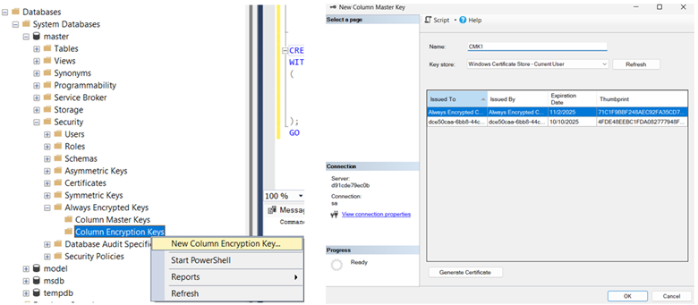
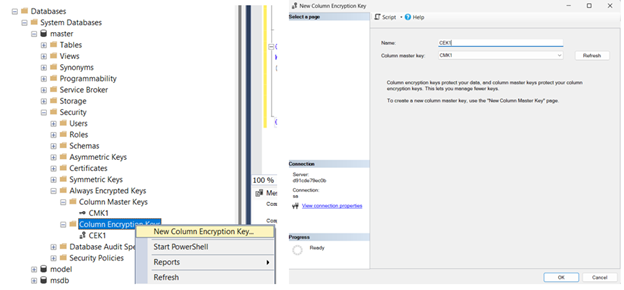
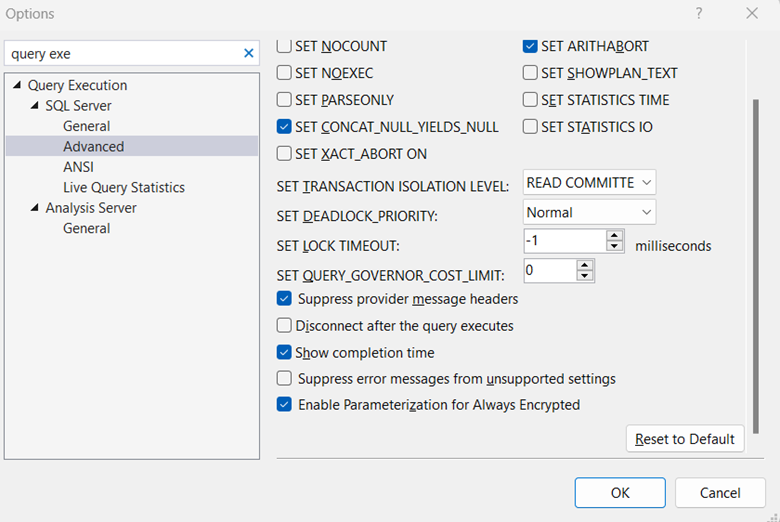
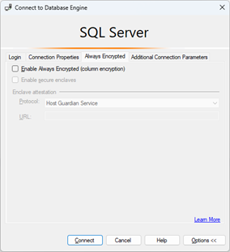

# Column Level Encryption in DB for sensitive info such as Credit Cards 

# SQL Server Always Encrypted 

## To run MS SQL in Docker, run command: 
`docker run -e "ACCEPT_EULA=Y" -e "SA_PASSWORD=Sample123$" -p 1433:1433 -d mcr.microsoft.com/mssql/server:latest`

## 1. Create the DB
Note that if we use RDS SQL Server, we cannot use the default DB. 
Create a new DB if needed

## 2. Create the Column Master Key (CMK) and Column Encryption Keys (CEK)
Either use SSMS GUI or create the keys via SQL code. 




Note: To create the CMK, we require to select a certificate. 
For RDS SQL Server, we cannot upload our own certificate. 
We can only use the pre-created certs. 

Below is error message when creating own cert on RDS SQL Server: 


## 3. Create the encrypted table 
Create the table and specify the encrypted column (credit card number). 

Command: 
```
USE [test-db-1]
CREATE TABLE CustomerInfo (
    CustomerID INT NOT NULL PRIMARY KEY,
    CustomerName NVARCHAR(50) NOT NULL,
    CustomerCreditCard INT ENCRYPTED WITH (
        ENCRYPTION_TYPE = Deterministic,
        ALGORITHM = 'AEAD_AES_256_CBC_HMAC_SHA_256
        COLUMN_ENCRYPTION_KEY = CEK_1
    ) NOT NULL
)
```

## 4. Enable Always Encrypted Mode 

Ensure that Always Encrypted mode is enabled in SSMS. 

4.1. Go to SSMS settings and enable "Parameterization for Always Encrypted" 



4.2. Restart the SSMS connection and enable Always Encrypted in the DB connection settings 



## 5. Insert data into the table (with the encrypted field)

Note that the normal insert commands will fail due to the encrypted commands. 

This will not work: 
```
INSERT INTO CustomerInfo (CustomerID, CustomerName, CustomerCreditCard)
VALUES (1, 'Alice Johnson', 123);
```

We need to parameterize the INSERT statements for it to work. 
```
DECLARE @id INT = 21
DECLARE @name NVARCHAR(50) = 'Kalle'
DECLARE @card INT = 45
insert into CustomerInfo (CustomerID, CustomerName, CustomerCreditCard) 
VALUES (@id, @name, @card)
```


## 6. Query data from client-side application (eg Python)
Querying the data requires access to the certificate keys. 

From the Create Column Master Key screen, we can export out the certificate used to create this CMK. 
Access to the encrypted column is controlled by this certificate. 

# Oracle DB TDE Column Encryption
