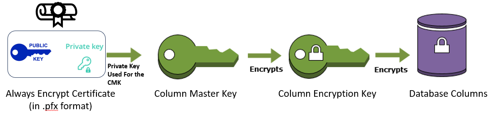

# Demo Guide of SQL Server Always Encrypted on AWS RDS 

SQL Server Always Encrypted documentation - https://learn.microsoft.com/en-us/sql/relational-databases/security/encryption/always-encrypted-database-engine?view=sql-server-ver16

## 1. Create SQL Server instance on RDS. Alter Security Group rules to allow connection via MS SQL. 

Use https://whatismyipaddress.com/ to find out own IP address and add into security group. 


## 2. Connect to SQL instance using SSMS. (with DB admin account)

## 3. Create a new test DB. Eg `test-db-1`

## 4. Understand the flow required for creating the Always Encrypted Keys. 



Terminology: 

CMK - Column Master Key

CEK - Column Encryption Key

## 5. In the new DB, create the CMK. 
To create the CMK, we need to select the required cert. 
The Certificates can be viewed when creating the CMK. 


<ins>Why we cannot import our own certificates into RDS SQL Server</ins>

Note that in AWS RDS, as this is a managed SQL instance, we are unable to import our own certs. 
We can only generate certs in RDS via SSMS. 

Below is the error message when we try to import our own cert. Error message shows that we do not have enough permissions. 


Perhaps using [RDS Custom](https://docs.aws.amazon.com/AmazonRDS/latest/UserGuide/rds-custom.html) will allow us to have the required permissions. 

Note down the cert used to create the CMK. 

## 6. Export the cert used to create the CMK. 


In the CMK creation screen, double click the certificate used. 


Navigate to `Details` => `Copy to File`. Save the file locally. Input a passphrase if required. 

To allow other users to have access to the CMK and CEK (and subsequently the Always Encrypted sensitive column), they will need to install this cert and reference this when connecting to SQL Server. 

Keep the cert somewhere safe. 

## 7. Create the CEK. 

Similar to the CMK, use the GUI to create a CEK. The CEK requires access to the previously created CMK. 


## 8. Create the encrypted table. 

For this demo, we will create a table of customer data. The credit card information will be encrypted using Always Encrypted. 

Create Table Command: 
```
USE [test-db-1]
CREATE TABLE CustomerInfo (
    CustomerID INT NOT NULL PRIMARY KEY, 
    CustomerName NVARCHAR(50) NOT NULL, 
    CustomerCreditCard INT ENCRYPTED WITH (
        ENCRYPTION_TYPE = Deterministic, 
        ALGORITHM = 'AEAD_AES_256_CBC_HMAC_SHA_256', 
        COLUMN_ENCRYPTION_KEY = CEK_1
    ) NOT NULL
)
```


## 9. Enable Always Encrypt settings in SSMS 

Before we can interact with the Always Encrypt (AE) column, we need to configure SSMS first. 

Go to SSMS Options > Query Execution > Advanced > Enable Parameterization for Always Encrypted 


Reconnect back to SQL Server instance and enable AE 


## 10. Insert data into the table 

Note that due to how encryption is done at the client-side in Always Encrypted, normal INSERT statements will have to be parameterized. 

For more details, please refer to the Microsoft documentation [here](https://learn.microsoft.com/en-us/sql/relational-databases/security/encryption/always-encrypted-how-queries-against-encrypted-columns-work?view=sql-server-ver16) 

The below INSERT command will FAIL: 
```
INSERT INTO CustomerInfo (CustomerID, CustomerName, CustomerCreditCard)
VALUES (1, 'Alice Johnson', 123);

```

The below INSERT command will work: 
```
DECLARE @id INT = 21
DECLARE @name NVARCHAR(50) = 'Kalle'
DECLARE @card INT = 45
insert into CustomerInfo (CustomerID, CustomerName, CustomerCreditCard) 
VALUES (@id, @name, @card)

```


If we query the column, we will be able to see the encrypted data easily. 
This is as our current account has access to the certificates used to create the CMK and CEK. 

## 11. Create a new role and verify that data is encrypted 
### 11.1 Create a new role 

Use the following commands to create a new DB role (username `user-1` with password `user-1`): 
```
USE [master];
GO

--Create a server-level login 
CREATE LOGIN [user-1] WITH PASSWORD = 'user-1';
GO

--Set context to msdb database
USE [test-db-1];
GO

--Create a database user & link it to server-level login theirname
CREATE USER [user-1] FOR LOGIN [user-1];
GO

-- Grant permissions to select on table 
USE [test-db-1];
GRANT SELECT ON [dbo].[CustomerInfo] TO [user-1];

```

In this example, we will be using Python and ODBC drivers to access the encrypted column. 

### 11.2 Remove the certificate from the Windows Cert Store 

Windows machine is assumed to be used. 

Access the windows cert store with: 
`CTRL+R`, `certmgr.msc`


Delete all certs relating to Always Encrypted: 
- Note that these certs were present as we used the same machine to configure the DB and create the CMK / CEK previously. 


### 11.3 Run Python, configure to connect as the new user without certs installed

Python ODBC uses a connection string to authenticate and access the AE columns. 
In this demo, the connection string will use any certs installed in the Local Windows Cert Store. 
As we have removed the certs, this user will not be able to view the encrypted columns programmatically. 

Note: Python code works in Windows, but not WSL. Need to explore how to import certs into Linux. 

The below Python code is used to test this connection: 
```
import pyodbc 
connection_string = (
    "DRIVER={ODBC Driver 18 for SQL Server};"
    "SERVER=<INSERT-RDS-ENDPOINT>,1433;"
    "DATABASE=test-db-1;"
    "UID=user-1;"
    "PWD=user-1;"
    "Encrypt=yes;"
    "TrustServerCertificate=yes;"
    "ColumnEncryption=Enabled;"
    "KeyStoreAuthentication=WindowsCertificateStore;"
)

# Establish the connection
try:
    connection = pyodbc.connect(connection_string)
    print("Connection successful!")
    print(f"Connectiong string: {str(connection_string)}")

    # Create a cursor object to interact with the database
    cursor = connection.cursor()
    
    # Query data from table with enc info
    cursor.execute("SELECT * FROM [test-db-1].[dbo].[CustomerInfo]")
    rows = cursor.fetchall()
    for row in rows:
        print(str(row))

except pyodbc.Error as e:
    print("Error connecting to SQL Server:", e)

finally:
    # Close the connection
    if connection:
        connection.close()
```

Output: 

```
D:\Documents\playground\always_enc_sql_server>python code.py
Attempting to connect to local SQL SERVER DB.
Connection successful!
Connectiong string: DRIVER={ODBC Driver 18 for SQL Server};SERVER=<RDS-ENDPOINT>,1433;DATABASE=test-db-1;UID=user-1;PWD=user-1;Encrypt=yes;TrustServerCertificate=yes;ColumnEncryption=Enabled;KeyStoreAuthentication=WindowsCertificateStore;
Error connecting to SQL Server: ('CE027', "[CE027] [Microsoft][ODBC Driver 18 for SQL Server][SQL Server]Certificate in key path 'CurrentUser/My/D150F461220871288DD7E0ACADADE69D45FDC776' not found. (0) (SQLGetData); [CE027] [Microsoft][ODBC Driver 18 for SQL Server][SQL Server]The keystore provider MSSQL_CERTIFICATE_STORE failed to decrypt the ECEK CurrentUser/My/D150F461220871288DD7E0ACADADE69D45FDC776 with RSA_OAEP. (0)")
```


As expected, access to the column is denied. 
However, if we only SELECT the non-encrypted column (`SELECT CustomerName  FROM [test-db-1].[dbo].[CustomerInfo]`), this will work. 


### 11.4 Install the certs and execute again 

Using the previously exported cert, import it into the system. 
As we are using Windows, just double click the cert, which will trigger the Certificate Import Wizard. 


Once imported, we can verify in Windows Certificate Manager that the cert is present (refresh if needed)


Execute the Python code again. 

Now, the new user `user-1` is able to view the encrypted column. 
The credit card information is shown (the last column). 


## 12. Certificate Rotation 

Relevant documentation: 
- Always Encrypted Key Rotation with SSMS - https://learn.microsoft.com/en-us/sql/relational-databases/security/encryption/rotate-always-encrypted-keys-using-ssms?view=sql-server-ver16
- Overview of Keys in Always Encrypted - https://learn.microsoft.com/en-us/sql/relational-databases/security/encryption/overview-of-key-management-for-always-encrypted?view=sql-server-ver16


